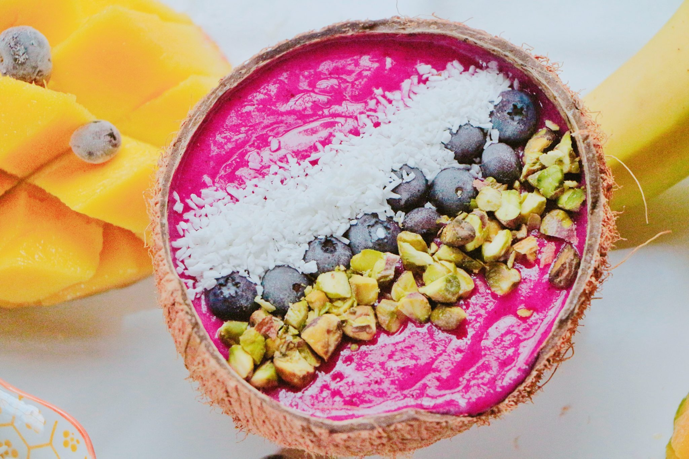

<h1 align="center"> Yogic Recipes </h1>

I created a full-stack C.R.U.D website for people interested in knowing more about Yogic Recipes with Positive 
Pranic food. The site is responsive on all devices, easy to use, read, add, update, and delete recipes. This is 
the third milestone project that I have created for Code Institute with my newly acquired skills 
<a href="https://yogic-recipes.herokuapp.com/" target="_blank">View website in Heroku</a>

<h1 align="center">
  <a href="https://yogic-recipes.herokuapp.com/" target="_blank"></a>
</h1>


## UX (User Experience)

### User stories

1. As a First time Visitor, I want the purpose of the website to be clear, the information easy to digest and locate, and the navigation easy to use. I would like to quickly locate the list of Positive Pranic foods and info where I can learn more about what type of food to eat that is Positive Pranic approved. 
2. As a First time Visitor, I would like to see that I can choose a category of recipes and only see the recipes for that specific category. Then I want to be able to click on each recipe to read the full recipe information without having to look through a jungle of other stuff in the way.  
3. As a First time Visitor, I want to be able to locate the full recipe easily and only see the recipe information which is sufficient with clear text and not much else that is unnecessary and distracting. 
4. As a First time Visitor, I want to quickly be able to find a recipe by using the search input. 
5. As a First time Visitor, I want to figure out how to add a recipe and do it without complication, the form should be straightforward and intuitive. There should be validation, selection, and character limits to know what type of input is okay. 
6. As a Returning Visitor, I want to be able to find out without effort how to Edit and similarly update a recipe like I Added a recipe, with all the current recipe information displayed in the form. 
7. As a Returning Visitor, I want to, without looking too long, find out how to Delete a recipe with clear steps and be asked two times before the recipe gets deleted. 
8. As a Returning Visitor, I want to be able to contact the owner of the website for any questions that I might have. I would also like to see if there are any links for social media that I can follow.

### Design

The design for this website was made to be beautiful, simple, intuitive, and clear. Nice color and artistic recipe images are chosen to enhance the aesthetics of the page and bring up an appetite. The text on the page is made clear with only the most essential, desired, and straightforward info for the user.

#### Color Scheme
The website is quite colorful and consistency is kept with the colors with suiting color combinations. The main colors are green and orange/red. 
- The colors on the start page are chosen to match the colors in the hero-image, especially in the food list headings where there are three different background colors after each other like the three main colors on the recipe food hero-image. 
- On the other pages, there is a green and red linear-gradient background-color, where there are green icons, a green SVG tree image, buttons in various shades of green placed in the navbar. The colors in the recipe cards are similar and contain icons with different shades of green and orange/red background color on the footer of the cards. The text throughout the website is dark green.
- The colors on the buttons are different from each other for clear distinction with good contrasting and bright colors to make them stand out more. 

#### Typography
The default Materialize font is chosen for the whole page because I think it’s an elegant and clean font. It makes nice headings with its thick font weights which helps the page look more stylish and at the same time easy to read. 

#### Images 
- The hero image on the Start page was chosen after much thought for beautifying the page and taking the attention of the user by zooming in the image smoothly with an animation. The image, that contains a dish with food, has strong and bright colors that lift up the page and makes the food look more delicious and fresher.
- The SVG image of a green tree that is displayed on the rest of the pages in the navbar is chosen for it’s a beautiful and simple look that just makes you feel good looking at it, and it lifts up the green background of the pages and makes a good compliment to the other green icons of fruits and leaves. 
- The recipe images are beautiful and appetizing, nicely contrasting with the other colors on the page. 

#### Text   
The main text is divided into two short parts to make the reading easier, only the most important text is displayed to *not overload the reader with too much text*. 
Right below there is a clear and clean table of lists with Positive Pranic foods. Headings, buttons, and forms are decorated with icons for enhancing the UX and making the page look more beautiful. 

### Wireframes 
- **Start** - <a href="https://drive.google.com/file/d/1Npzgm6jlZFWJvPWkKJcHlw5pqTOh8vut/view?usp=sharing" target="_blank">View</a>
- **Breakfast** - <a href="https://drive.google.com/file/d/1tPavcZVrpiXqrD5hRNUleNQsyYwj5n8G/view?usp=sharing" target="_blank">View</a>
- **Add Recipe** - <a href="https://drive.google.com/file/d/1kjWMr63B92IGIvW6rsgqgNLP2olJE5hG/view?usp=sharing" target="_blank">View</a>
- **Recipe Detail** - <a href="https://drive.google.com/file/d/1pv9gCkMi22abtW6bGUlj8eZgJbNK9F5n/view?usp=sharing" target="_blank">View</a>

## Features
Responsive on all device sizes.

### Existing Features
- **.**. 
- **.**.   
- **Footer Copyright**. To protect copyright.
- **Footer Contact button**. Clicking the button pops up a contact form modal.

### Features Left to Implement
- Functionality that makes it possible to upvote recipes. 
- Adding user authentication for being able to save recipes and control who gets to edit a recipe on the page. 

## Technologies Used

Languages Used for this project: **HTML**, **CSS**, **Javascript**, **Python**, **Flask** + **MongoDB**. 
1.  [Materialize](https://materializecss.com/): – for making the website responsive on all devices and for the styling. 

2.  [Font Awesome](https://fontawesome.com/): – icons were used for aesthetics and enhancing the UX.

3.  [Git](https://git-scm.com/): – was used for pushing the project’s code to GitHub through version control and Git committing. 

4.  [GitHub](https://github.com/): – is used to store the project’s code.

5.  [Draw.io](https://app.diagrams.net/): – was used to create and design the wireframes. Draw.io was also used to edit 
    the hero-image on the mobile Start page.

6.  [jQuery](https://jquery.com/): – was used as a library for Javascript for faster and easier coding.

7.  [EmailJS](https://www.emailjs.com/): – was used for sending email through the contact form.

7.  [Grammarly](https://www.grammarly.com/): – was used for correcting grammar on README file.

7.  [MongoDB](https://www.mongodb.com/cloud/atlas): – was used as database for storing and extracting data.

8. [Toptal](https://www.toptal.com/designers/colorfilter/): - Colorblind Web Page Filter, was used for checking the website how it looks for a colorblind person by using it's filter. 

## Testing
### Testing User stories from UX section:
1.   **As a First time Visitor, I want the purpose of the website to be clear, the information easy to digest and locate, and the navigation easy to use. I would like to quickly locate the list of Positive Pranic foods and info where I can learn more about what type of food to eat that is Positive Pranic approved.**
        - **a.**  Upon visiting the website the I see a large, bright colorful, and elegant hero-image of a fruity dish that is zooming gently in. On top of the hero-image, there is a box with text showing “Explore Positive Pranic Recipes” with a search input below. Above the image, there is a conventional simple navbar with the logo “Yogic Recipes” and the menu clearly visible. 
    
        - **b.**  The About section that comes right after the hero-image tells without a doubt what the page is about and what I can do on the page. There is also a link to another page with more info, when I click on it I am taken to that page. Scrolling down just a little bit, I see lists of Positive Pranic food, making it easy to understand quickly what foods are included in the Yogic diet. 
    
        - **c.** Scrolling down a little more, I see two videos with a short explanatory text below each video. One video is about why it is beneficial to eat Positive Pranic food, explained by a popular yogic called Sadhguru. The other video shows Positive Pranic recipes that are in video so that I can choose to watch or read the recipes for more clarity. 

2.   **As a First time Visitor, I would like to see that I can choose a category of recipes and only see the recipes for that specific category, which are clearly displayed. Then I want to be able to click on each recipe to read the full recipe information without having to look through a jungle of other stuff in the way, the recipes should be clearly lined out.**
        - **a.**  Upon entering the page, I see the navbar which is clear and has a dropdown to the right with the name “Recipes” where all the categories are displayed when clicking on it. 
    
        - **b.** When clicking on any of the category names in the dropdown in the navbar, I am taken to that category with its belonging recipes. The recipes are displayed in cards with a clean recipe image, recipe name, and recipe time. When hovering over the recipe image I see the image darkening indicating that it is a link and the same with the underlined recipe name that changes color when hovering over it.  
    
        - **c.**  On clicking either the recipe image or recipe name, I am taken to see the full recipe. If I wish to go back to the previous category there is a colourful large button above that takes me back to the recipe category when clicking on it. Next to the category button, there is also an All Recipes button which takes me to see all recipes in card format when clicking on it. 

3.   **As a First time Visitor, I want to be able to locate the full recipe easily and only see the recipe information which is sufficient with clear text and not much else that is unnecessary and distracting.**
        - **a.** By clicking the dropdown in the navbar I can click on any of the links that take me to see the recipes in card format where all recipes have a clickable recipe image and recipe name. I can also search for a recipe in the search input that is clearly visible on all pages to get the recipes in the card format by searching for the recipe name or recipe time. 
    
        - **b.** By clicking on the recipe name or recipe image in the recipe cards I am taken to see the full recipe information for only that single recipe. 
    
        - **c.** Upon entering the Recipe Detail page where the full recipe is shown, I see a simple and clear recipe with easy readability, and pleasant for the eyes with subtle stylish coloring. I see the same recipe image first and the same recipe name of the card I clicked, below is more information like portions, time, ingredients, and instructions put in a structured and tidy way. 

4.   **As a First time Visitor, I want to figure out how to add a recipe and do it without complication, the form should be straightforward and intuitive. There should be validation, selection, and character limits to know what type of input is okay.**
        - **a.** In the navbar, I see a link always visible with the name “Add Recipe”. When I click on the link, I am taken to the Add Recipe page where there is a form with labels and colorful icons explaining what information I should add in the inputs and select options. Scrolling down to the bottom of the form I see a large pink button with the name Add Recipe and a plus icon. 
    
        - **b.** When I click on the Add Recipe button without writing anything on the form, I see a text that specifies that the inputs and select options must be filled out to submit the form. When I write the wrong input and select an invalid option, I see a red border color below, when I write the correct input and select a valid option then I see a green border below. Once submitting the form after everything is valid I see a flash message saying “Recipe was Successfully Added” on the All Recipes page where I am taken, I scroll down and I see that the new recipe I added is there. 
    
        - **c.** For seeing if there is any character limit on the Recipe Name and Time in minutes, I press down a letter on the keyboard and I see that after a short while the characters are stopped in the inputs and I am prevented to add more characters. 

5.   **As a First time Visitor, I want to be able to find out without effort how to Edit and Update a recipe in a similar manner like I Added a recipe, with all the current recipe information displayed in the form.**
        - **a.**  When I am on the Recipe Detail page where the full recipe is shown, I see a large colorful button on the top right with the name “Edit Recipe” with an edit icon. When I click on it, I am taken to the “Edit Recipe” page and I see a heading with the name “Update Recipe”. 
    
        - **b.** The form and its content look the same as the form for the “Add Recipe”, with the current recipe information displayed in the inputs and select options. 
    
        - **c.** After I change the inputs and selections, I click on the Update Recipe button and I am taken to the All Recipes page where a flash message is displaying “Recipe was Successfully Updated” I scroll down and see that the recipe that I updated has a different recipe name, I click on the recipe name to see the full recipe and I see there that all the text I changed in the recipe is showing.

6.	**As a Returning Visitor, I want to, without looking too long, find out how to Delete a recipe with clear steps and be asked two times before the recipe gets deleted.  I want to also find where I can cancel from doing any changes to the recipe.**

    - **a.** When I am on the Edit Recipe page where I can edit and update the recipe, I see a large red button with the name “Delete Recipe”. When I click on it, a modal comes up with the heading “Are you sure you want to DELETE this recipe? There are two buttons with different colors and icons on the modal with the text, “No Cancel” and “Yes Delete”.
    
    - **b.**  When I click on the No Cancel button in the modal, the modal closes. When I click on the Delete Recipe button I am taken to the All Recipes page where a flash message is showing “Recipe was deleted Successfully”, I scroll down and I cant see the recipe I deleted anymore. 
    
    - **c.**  On the Edit Recipe page there is a large blue button with the name “Cancel” and an x icon. When I click on it, I am taken to the All Recipes page.  

7.	**As a Returning Visitor, I want to quickly be able to find a recipe by using the search input.**

    - **a.** On the Start page, I see a search button clearly lined out with two buttons on the side of the hero-image with an infobox above with the large text “Explore Positive Pranic Foods”. On all other pages, there is a search input always visible at the top in the navbar. 
    
    - **b.** Upon writing something in the search input that I know will not give any results when clicking on the search button or pressing enter, I  am taken to the All Recipes page where a red text is displaying “No Results Found. When I click on the Reset button next to the search input, all recipes show up in the All Recipes page. 
    
    - **c.** When typing in the search input looking for either the recipe name or the recipe in minutes, all the recipes show up that has the same word in it that I searched with. The same happens when searching by number, all the recipes with the same time shows up. 

8.	**As a Returning Visitor, I want to be able to contact the owner of the website for any questions that I might have.  I would also like to see if there are any social links for following on social media.**

    - **a.** At the bottom of each page, there is a clear footer with a Contact button, three social media icons, and copyright. When clicking on any of the social media icons I am taken to each respective social media page. 
    
    - **b.** On clicking the Contact button, a modal comes up displaying a simple form with Name input, Email, and Message area. When trying to submit the form with an incorrect name or email, a red text shows up under the inputs saying the inputs are not valid. When the inputs are valid, a green text shows up saying it's valid.  
    
    - **c.** When clicking the Send Message button, a loader comes up, and then shortly after, a message is displayed saying “Your message was Successfully sent”. When clicking the close button in the modal, the modal disappears and when opening the modal again the form is reset. 


### Additional Testing 
- The website was tested on multiple browsers such as Google Chrome, Microsoft Edge, Firefox, and Opera. 
- Much time was given to test all the C.R.U.D functionalities and links on the page. 
- My mentor viewed the website to see that all is looking good and working well. 
- The website was tested on various devices such as Desktop, Ipad, Samsung and, iPhone mobiles.  
- The code was run through the W3C Markup Validation Service and the results show only error for the Flask code,
    the HTML and CSS code on all pages are without error. The results can be viewed here: 
    - **start.html** -  <a href="" target="_blank">Result</a>
    - **base.html** - <a href="" target="_blank">Result</a>
    - **category.html** - <a href="" target="_blank">Result</a>
    - **recipe_detail.html** - <a href="" target="_blank">Result</a>
    - **add_recipe.html** - <a href="" target="_blank">Result</a>
    - **edit_recipe.css** - <a href="" target="_blank">Result</a>
    - **all_recipes.html** - <a href="" target="_blank">Result</a>

### Known bugs 

Not really a bug, but I am aware of that the colors red and green that are used a lot on the website, are not seen by colorblind people. I have checked the website through a filter for colorblindness, and everything looks good and pretty anyway. Everything on the page, despite this, is clear and well lined out. 

## Deployment

### The project was deployed to Heroku by executing these steps:  

1. Log in to Heroku and go to the dashboard.
2. Click the "New" button on the top right corner and select in the dropdown "Create a new app"
3. Under the "App name" label, write the name that you want the app to have in the input. 
4. Then choose a region closest to you on the select option.
5. Click the purple "Create app" button. 
6. Around the middle of the page, look for the section where the "Deployment method" is and choose to connect to GitHub.
7. On the select option that comes up, make sure your GitHub profile is displayed in the select option that comes up after selecting GitHub deployment.
9. Then add your repository name and click on the purple "Search" button next to the input.
10. Once it finds your repository click on the white "Connect" button.
11. Click on the "Settings" tab and then click on the "Reveal Config Vars" button.
12. On the Config Vars section, write the IP in the first input and 0.0.0.0 on the input next to it then click on the purple "Add" button.
13. On the next two inputs, write PORT and 5000 and then click "Add"
14. On the next two inputs, write "SECRET_KEY and paste in your key from your env file and click "Add" 
15. On the next two inputs, write MONGO_URI and paste in your Mongo URI and click "Add"
16. On the last two next inputs, write MONGO_DBNAME and yogic_recipes and click "Add"
17. Go back to the Deploy tab.
17. Go to your terminal and push the Procfile and requirements.txt files to your Github repository.
18. Go back to the Heroku page to the Deploy tab and click the grey button that says "Enable Automatic Deploys".
19. Then click on the grey button that says "Deploy Branch". 
20. After the Heroku has finished building the app, you will see a message saying "Your app was successfully deployed" and a "View" button.
21. Finally click on the "View" button. 

### How to clone this project to run locally: 
1.  First log in to GitHub, then go into the project’s repository by clicking this link [GitHub Repository](https://github.com/danikrs/data-centric)
2.  Under the repository name, click the green "Code" button.
3.  Then choose "Clone with HTTPS" and copy the link.
4.  Open Git Bash in your local IDE.
5.  Change the current working directory to the location where you want the cloned directory to be made.
6.  Type git clone, and then paste the URL you copied in Step 3.
```console
git clone https://github.com/YOUR-USERNAME/YOUR-REPOSITORY
```
7.  Press Enter. Your local clone is now created.

For more information about how to clone a repository click [here](https://docs.github.com/en/github/creating-cloning-and-archiving-repositories/cloning-a-repository)


## Credits

**Note**: The content of this website is for educational purposes only.

### Code

### Content

The text on the start page is written by me. The text for the recipes are taken from here [Positive Pranic](https://positivepranic.com/) 
and here [10 Vegan Smoothies](https://mindfulavocado.com/vegan-smoothie-recipes/) 

### Media

The hero-image was found using the Ecosia search engine. The recipe images were found on the two sites mentioned above. The videos are from YouTube. 

### Acknowledgements
- Tim's Task Manager tutorial videos from the course. 
- My mentor at Code Institute for his guidance and feedback.
- The tutor support at Code Institute for tutoring.